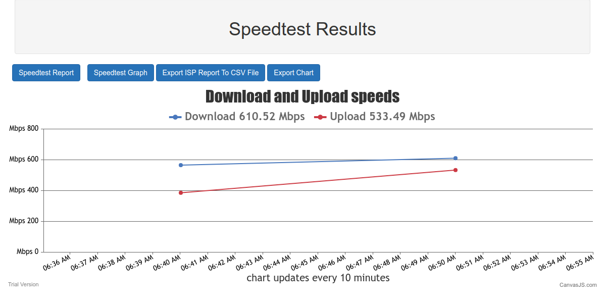
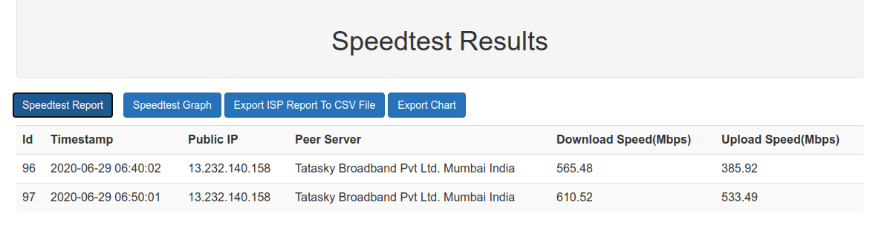

# speedtest-docker
1 - Install Docker, You can use --> https://www.digitalocean.com/community/tutorials/how-to-install-and-use-docker-on-ubuntu-20-04 

2 - Install docker-compose --> sudo apt install docker-compose

3 - git clone https://github.com/rk280392/speedtest-docker.git

4 - cd speedtest-docker

5 - sudo docker-compose up -d

This will run flask app on port 5007, which will be accessible from 127.0.0.1:5007. If this port is already used on your system please change the port in the docker-compose.yaml file.

